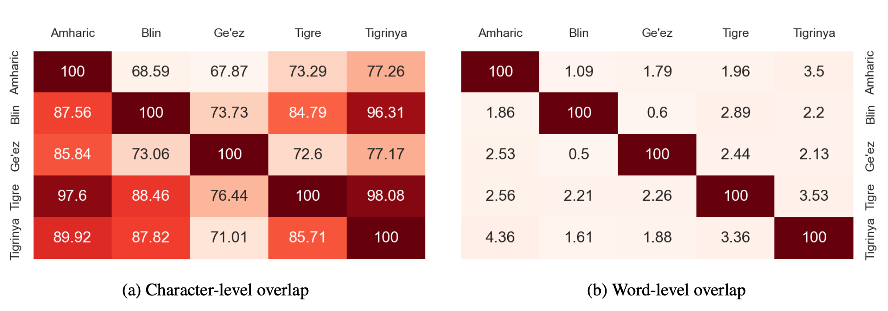

# GeezSwitch Dataset

A benchmark dataset for Language Identification (LI) between five low-resourced languages that use the Ge'ez script as a writing system: Amharic (አማርኛ), Blin (ብሊን), Ge'ez (ግእዝ), Tigre (ትግረ), and Tigrinya (ትግርኛ).

The five languages are spoken by over 42 million people in total, in Ethiopia and Eritrea and the global diaspora of the regions.
However, there is a lack of research on automatically distinguishing texts of these languages, and GeezSwitch is one step towards that.

> The dataset is described in the paper: *"GeezSwitch: Language Identification in Typologically Related Low-resourced East African Languages"* published at LREC 2022.

A Python package that includes the GeezSwitch dataset can be found [here](https://github.com/fgaim/geezswitch). It can identify between 60 languages with ~99% accuracy.

## Dataset

__Dataset Overview__

The dataset has three parts [train, test, and development] that are located in the `data` directory, as follows:

```
data/train.tsv
data/test.tsv
data/dev.tsv
```

Each line in the files contains **three** tab [\t] separated values:


|  Column  |   Field   |  Description   |
|----------|-----------|----------------|
|     1    | Sample ID | A sequential number of samples [1-n]. |
|     2    | Language  | Name of language, one of: amharic, blin, geez, tigre, tigrinya. |
|     3    |   Text    | A sample text in the given language, which can be a sentence or phrase. |


__Data Statistics__

|  Language  | Family |  Branch  | Speakers | ISO 639-3 | Samples | Tokens | Vocab. |  Char. |
|:----------:|:------:|:--------:|:--------:|:---------:|:-------:|:------:|:------:|:----:|
| Amharic | Afro-Asiatic | Semitic | 32M | amh | 3k | 49.3k | 20.1k | 277 |
| Blin | Afro-Asiatic | Cushitic | 120k | byn | 3k | 35.3k | 11.8k | 217 |
| Ge'ez | Afro-Asiatic | Semitic | extinct* | gez | 3k | 48.6k | 14.3k | 219 |
| Tigre | Afro-Asiatic | Semitic | 1M | tig | 3k | 53.8k | 15.4k | 208 |
| Tigrinya | Afro-Asiatic | Semitic | 9M | tir | 3k | 49.0k | 16.2k | 238 |
| Dataset | | | | | 15k | 236k | 74.9k | 331 |

> \* The Ge'ez language is no longer used as colloquial, and limited as the liturgical language of the Orthodox and Catholic churches of both Eritrea and Ethiopia.

Tokens: the total number of words/tokens;  
Vocab: the vocabulary, number of unique words);  
Char: the number of unique characters for each language in the dataset.  

__Character and Word-level Overlaps__

The exical similarity between the languages in GeezSwitch at character and word levels.



For a cell *(lr, lc)* in the matrix, where *lr* and *lc* represent the languages indicated by the row and column, then the corresponding value of the cell is the percentage of elements in *lr* that overlap with *lc*.

## Disclaimer

The GeezSwitch dataset was automatically collected from sources on the internet.
If any part of the content is discovered to be inappropriate for redistributed — for legal,  ethical, or any other reasons – please contact the authors and immediate action will be taken.
This data is shared to advance research on the target languages and the authors do not claim any copyright on the content.

## Citation

If you use GeezSwitch in your research, please cite as follows:

``` markdown
@inproceedings{fgaim2022geezswitch,
  title={GeezSwitch: Language Identification in Typologically Related Low-resourced East African Languages},
  author={Fitsum Gaim and Wonsuk Yang and Jong C. Park},
  booktitle={Proceedings of the 13th Language Resources and Evaluation Conference},
  year={2022}
}
```

## License

This resource can be used for research purposes.
Please cite the corresponding publication.
